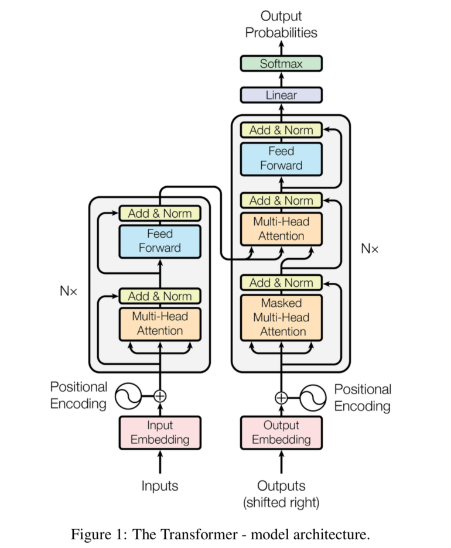

# Seq2Seq Models (LTSM & Transformers)

## 1. The Models

### Seq2Seq

Sequence to sequence models consist of **Encoders** and **Decoders**. The **Encoder** takes the input sequence and maps it into a higher dimensional space (n-dimensional vector). The abtract vector is fed into the **Decoder**, which turns it into an _output sequence_. The _output sequence_ can be a language, symbols, a copy of the input etc.

> _Intuition_ : Imagine the Encoder and Decoder are two translators, where the Encoder knows language A & B, while the Decoder knows language B & C. The Encoder translates A into B, and the Decoder translates B into C. Suppose, initially, neither the Encoder nor Decoder is fluent in language B. We train them (the model) using a lot of examples for language B

A basic choice for the Encoder and Decoder of the _sequence to sequence_ model is a **single LSTM** for each.

### Long Short Term Memory (LSTM)

LSTM models utilize _recurrent neural networks_. They used to be one of the best ways to capture the time dependencies in sequences, before the emergence of Transformers.

As a _sequence to sequence_ model, LSTM is good for sentence to sentence translation, where retaining important words from previous sentences (and forgetting unimportant ones) is important.

### Transformers

**Transformers** are sequence to sequence models with an _[attention mecahnism](https://skymind.ai/wiki/attention-mechanism-memory-network)_, which was introduced in the paper _[Attention is All You Need](https://arxiv.org/abs/1706.03762)_. The _attention mechanism_ takes each input sequence and determines which of its elements are most important.

> _Intuition_ : Imagine that our Encoder passes along keywords that are important to the translated sentence, as well as the sentence in B translated from A. These new keywords make it easier for the Decoder to translate B into C, since it knows the keywords to focus on from the given sentence context.

A popular use of Transformers is [BERT (Bidirectional Encoder Representations for Transformers)](https://arxiv.org/abs/1810.04805)

Figure 1 (_from ['Attention is All You Need'](https://arxiv.org/abs/1706.03762) by Vaswani et al._) illustrates the basic diagram of a Transformer model. The **Encoder** sits on the left, while the **Decoder** sits on the right. The inputs and outputs (target sentenes) are initially _embedded_ into n-dimensional spaces for the models.

Both the **Encoder** and **Decoder** are composed of _modules_ that can be stacked on top of each other. This is illustrated with 'Nx'. The modules mainly consist of **Multi-Head Attention** and **Feed Forward** layers.

## 2. References

1. [What is a Transformer?](https://medium.com/inside-machine-learning/what-is-a-transformer-d07dd1fbec04)
2. [Attention is All You Need](https://arxiv.org/abs/1706.03762)
