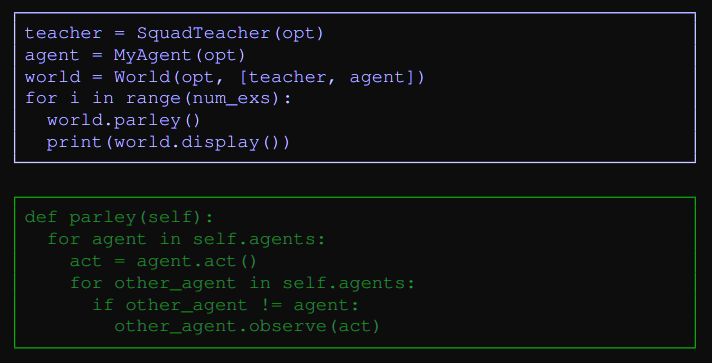

# ParlAI: A Dialog Research Software Platform

This paper introduces [ParlAI](https://parl.ai/docs/index.html), an open-source Python library for dialog research, developed by Facebook.

## Key Points

### 1. Introducing ParlAI

> "Solving dialog is a fundamental goal for researchers in the NLP community"

- Solving dialog" could encompass not only generation of natural language and flow, but also accomplishing developer-designated tasks.
- Training dialog models using a limited dataset can lead to biased results, where the models might overfit the different _characteristics_ of dasets.
- Types of datasets incluce:
  - WebQuest ions
  - SQuAD
  - bAbI

> **ParlAI** "provides rsearchers a unified framework for training and testing dialog models"

- **ParlAI** specializes in training and evaluating over _multiple tasks_ at once
- Also supports integration with **Amazon Mechanical Turk**
- Unifies various datasets into a _single format_ --> standardization

### 2. General Makeup of ParlAI

1. **Tasks**

- includes fixed supervised/imitation learning datasets (i.e. conversation logs)
- interactive (online or reinforcement learning)\_ tasks
- real language / simulated tasks
- **Types of Tasks**:
  - Question Answering (QA)
  - Sentence Completion (Cloze Tests)
  - Goal-Oriented Dialog
  - Chit-Chat
  - Visual Dialog
- **File Structure for Each Task**:
  - `build.py` : file to download and setup data for tasks.
  - `agents.py` : contains teacher class(es) and agents that live in the world
  - `worlds.py` : optionally added for tasks that
    need to define new/complex environments.
  - To build a task, one must implement `build.py` to download the data and use `agent.py` for the teacher.

2. **Concepts (classes)**

- **world** - the environment holding agents
- **agent** - an agent that can act (speak) in the world. Can be a learner (ML system), a bot (to interact w/ learners), or a human (Turkers)
- **teacher** - a type of agent that talks to the learner to teach it

  

3. **Action/Observation Object**
   > _NOTE : Field descriptions directly from the [paper](https://arxiv.org/pdf/1705.06476.pdf)_

- All agents (Students and Teachers) speak to each other through **1) action** and **2) observation** object (a single Python `dict`)
- The fields of the message are:
  - _text_ : a speech act
  - _id_ : the speaker's identity
  - _reward_ : a real-valued reward assigned to the receiver of the message
  - _episode_done_: indicates the end of a dialog
- For supervised datasets, there are additional labels:
  - _label_ : a set of answers the speaker expects in reply (i.e. the right answer to a question in QA datasets)
  - _label_candidates_ : a set of possible answers supplied by a teacher (i.e. the multiple choice choices in a QA dataset)
  - _text_candidates_ : ranked candidates for responses. **(?)**
  - _metrics_ : Metric for teacher to communicate to a learning agent

### 3. Agents

### 4. Example Mains

> _NOTE : Module descriptions & code examples directly from the [paper](https://arxiv.org/pdf/1705.06476.pdf)_

- `display_data`: display data from a particular task provided on the command-line.
- `display_model`: show the predictions of a
  provided model.
- `eval_model`: compute evaluation metrics for
  a given model on a given task.
- `train_model`: execute a standard training
  procedure with a given task and model, including logging and possibly alternating between training and validation.

### 5. Tasks

## References

- [ParlAI: A Dialog Research Software Platform](https://arxiv.org/pdf/1705.06476.pdf) by Miller et al.
